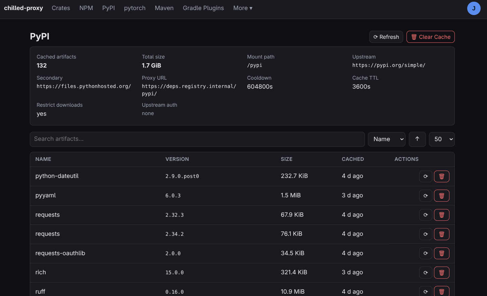

Chilled Proxy
=============

A multi-registry caching proxy — **crates.io, npm, PyPI, and Maven** on one listener — with a
configurable **cooldown**: versions newer than a chosen window are hidden, so freshly-published
(possibly malicious) releases are withheld until the community has had time to detect and yank
them. Built on [`crates-io-proxy`](https://github.com/ravenexp/crates-io-proxy) with age-gating
derived from [menhera.org's cooldown proxy](https://www.menhera.org/crates-io-cooldown-proxy-mitigating-supply-chain-attacks/)
— see [Acknowledgements](#acknowledgements).

**Warning:** not reviewed for security issues; intended for homelab use, not the open internet.
Pin a tagged image version — breaking changes are expected.

## Quickstart

```sh
 # 7-day cooldown for every registry
chilled-proxy --cooldown 7d 
# 7-day cooldown for every registry with UI enabled and builtin authentication
chilled-proxy --cooldown 7d --ui --ui-auth builtin --ui-trust-first-user-signup  
```



Each registry mounts under a path prefix on one port (default `3080`):

| Default mount | Registry | Client setting |
| --- | --- | --- |
| `/crates` | crates.io | `.cargo/config.toml` sparse index |
| `/npm` | npm | `.npmrc` `registry=` |
| `/pypi` | PyPI | pip/uv `index-url` |
| `/maven` | Maven Central | `settings.xml` mirror / Gradle init script |

Maven also gets `/gradle-plugins` and `/google-maven` out of the box — a Gradle build needs all
three. See [Mount paths](#mount-paths) and [Multiple mounts](#multiple-mounts).

### Client configuration

**cargo** (`.cargo/config.toml`):

```toml
[source.crates-io]
replace-with = "chilled"

[registries.chilled]
index = "sparse+http://proxy.example.com:3080/crates/index/"
```

**npm / pnpm / yarn** (`.npmrc`):

```
registry=http://proxy.example.com:3080/npm/
```

**pip** (`pip.conf`) / **uv**:

```ini
[global]
index-url = http://proxy.example.com:3080/pypi/simple/
```

**Maven** (`~/.m2/settings.xml`):

```xml
<mirrors><mirror>
  <id>chilled</id><mirrorOf>central</mirrorOf>
  <url>http://proxy.example.com:3080/maven</url>
</mirror></mirrors>
```

**Gradle** ignores `settings.xml` mirrors. Copy
[`examples/gradle/chilled.init.gradle`](examples/gradle/chilled.init.gradle) into
`~/.gradle/init.d/` (or pass with `-I`) and set `CHILLED_PROXY_URL=http://proxy.example.com:3080`
(or the `chilled.proxy.url` system property). The script rewrites Maven Central → `/maven`, the
Plugin Portal → `/gradle-plugins`, and Google Maven → `/google-maven` across all repository
blocks — including settings-level ones, hooked early enough that `settings.gradle` plugin
resolution is gated too. Override any one mount with `CHILLED_MAVEN_URL`,
`CHILLED_MAVEN_PLUGINS_URL`, or `CHILLED_MAVEN_GOOGLE_URL`; run with `--info` to see rewrites.

### General vs per-registry knobs

General flags apply to all four registries; per-registry variants override them. Env vars use
the `CHILLED_*` prefix (flag name uppercased).

| General flag | Per-registry variants | Default |
| --- | --- | --- |
| `--cooldown` | `--cooldown-crates` `--cooldown-npm` `--cooldown-pypi` `--cooldown-maven` | `0` (off) |
| `--cache-ttl` | `--cache-ttl-crates` ... | `3600` |
| `--cooldown-overrides` | `--cooldown-overrides-crates` ... (replaces the general list) | empty |
| `--restrict-downloads` | `--restrict-downloads-crates` ... (`=false` opts out) | off |
| `--max-metadata-size` | `--max-metadata-size-crates` ... | per-registry (below) |
| `--max-artifact-size` | `--max-artifact-size-crates` ... | per-registry (below) |
| `--cache-dir` | (registries use `<cache-dir>/<mount>`) | `/var/cache/chilled` |
| — | `--crates-path` `--npm-path` `--pypi-path` `--maven-path` | `/<registry>` |
| — | `--crates-mount` `--npm-mount` ... (repeatable) | see [Multiple mounts](#multiple-mounts) |

Disable a registry with `--disable-{crates,npm,pypi,maven}`.

```sh
chilled-proxy --cooldown 7d --cooldown-npm 2d --cooldown-maven 0
```

### Size caps

Responses over the cap are refused with `507`, never truncated. Suffixes `k`/`m`/`g` (powers of
1024). Defaults are per-registry:

| Registry | `--max-metadata-size` | `--max-artifact-size` |
| --- | --- | --- |
| crates.io | 64 MiB | 16 MiB |
| npm | 64 MiB | 256 MiB |
| PyPI | 64 MiB | 256 MiB |
| Maven | 8 MiB | 512 MiB |

Precedence: mount key > per-registry flag > general flag > built-in default. Bodies are buffered
in memory, so **`--max-artifact-size` is also a per-request memory ceiling** — size it against
available RAM × expected concurrent downloads. CUDA wheels (~349 MiB) are the usual reason to
raise PyPI's:

```sh
chilled-proxy --max-artifact-size-pypi 512m
```

Or keep large ML wheels on their own mount:

```sh
chilled-proxy --pypi-mount 'name=pytorch,upstream=https://download.pytorch.org/whl/cpu/,\
  files=https://download-r2.pytorch.org/,cooldown=180d,max-artifact-size=2g'
```

### Multi-host indexes

An index may host files on several hosts (PyTorch: its own CDN + PyPI's). The file's host is
read from the index document but honored only when allowlisted; anything else falls back to
substituting `files=` (which is how an internal mirror works). The allowlist automatically
contains the mount's own index and `files=` hosts, so ordinary mounts need nothing:

```
--pypi-mount 'name=pytorch,...,file-hosts=download-r2.pytorch.org'
--pypi-file-hosts 'host-a.example host-b.example'    # general, space-separated
```

The gate and the download resolve from the same index entry, so they cannot disagree.

### HTML upstreams

PEP 691 JSON is requested first (it carries upload times); an HTML-only (PEP 503) index is
parsed into the same model, reading the `data-upload-time` convention (PyTorch, devpi). The rule
is fail-closed per file: an entry without a usable upload time is withheld under a cooldown, and
an index where nothing is datable serves as **empty** (with a loud log) rather than erroring —
resolvers fall through to an index that can date the package. For an index that dates only some
projects (PyTorch dates `torch` but not its re-listed dependencies), resolve each half from the
index that can date it, e.g. `uv pip install --no-deps --default-index "$PYTORCH" torch`, deps
from the PyPI mount.

### Mount paths

`--<registry>-path` sets each mount (absolute; default `/<registry>`). Rewritten metadata URLs
(cargo `config.json` `dl`, npm tarballs, PyPI files) follow automatically.

A registry may take `/` only when it is the sole one enabled; the server's own endpoints still
win at the root. **Reserved:** `/healthz`, `/metrics`, `/ui`, `/api` (and everything beneath).
Mounts must be distinct and may not nest. All checked at startup.

### Multiple mounts

One mount serves one upstream; repeat `--<registry>-mount` with `key=value` specs for more:

```sh
chilled-proxy --cooldown 7d \
  --maven-mount name=internal,upstream=https://nexus.corp.example.com/repository/maven-public/ \
  --npm-mount   name=npm-fast,path=/npm-edge,cooldown=1d
```

Only `name` is required — it keys `/metrics`, the cache subdirectory, and the default path
(`/<name>`). Everything else falls back to the registry's flags, then the general ones.

| Key | Applies to | Default |
| --- | --- | --- |
| `name` | all | *required* |
| `path` | all | `/<name>` |
| `upstream` | all | the registry's `--<registry>-upstream-url` |
| `index` | crates.io | `--crates-index-url` |
| `files` | PyPI | `--pypi-files-url` |
| `file-hosts` | PyPI | `--pypi-file-hosts` (replaces, not extends) |
| `proxy-url` | all | `--reverse-proxy-url` + path, else derived from `--listen` |
| `cooldown` `cache-ttl` `restrict-downloads` | all | registry flag, then general |
| `max-metadata-size` `max-artifact-size` | all | registry flag, general, built-in |

A mount setting `upstream=` on a two-URL registry must also set `index=` (crates.io) or `files=`
(PyPI) — inheriting the public default there is refused. In env vars, separate whole specs with
`;` (`CHILLED_MAVEN_MOUNTS='name=a,...;name=b,...'`). Cooldown-override lists are not settable
per mount (they inherit).

**Built-in mounts** `/gradle-plugins` (`plugins.gradle.org/m2/`) and `/google-maven`
(`dl.google.com/dl/android/maven2/`) inherit Maven's settings. Replace one with a same-named
`--maven-mount`, drop both with `--no-default-mounts`; `--disable-maven` takes them too.

### Upstream authentication

Private upstreams take credentials per mount — basic auth or arbitrary headers — attached to
every upstream request that mount makes. Prefer the env vars for secrets (`<NAME>` is the mount
name uppercased, `-`/`.` → `_`):

```
CHILLED_INTERNAL_BASIC_AUTH_USERNAME=ci
CHILLED_INTERNAL_BASIC_AUTH_PASSWORD=s3cr3t
CHILLED_INTERNAL_HEADERS='X-Build: nightly; X-Team: platform'
```

CLI equivalents (repeatable): `--upstream-basic-auth 'internal=ci:s3cr3t'`,
`--upstream-header 'internal=Authorization: Bearer <token>'`.

Notes: argv is readable via `ps` — use the env vars for secrets. Credentials never cross mounts
(each authenticated mount gets its own HTTP client) but do cover both of a mount's URLs (index +
download host). Typos — unknown mount, half a credential pair, basic auth plus an explicit
`Authorization` header — fail at startup. Credentials never appear in logs.

### Exempting packages from the cooldown

`--cooldown-overrides` takes a comma-separated list served unfiltered (your own first-party
packages). Case-insensitive, canonical names per registry: crates.io as-published, npm
`@scope/name`, PyPI [PEP 503-normalized](https://peps.python.org/pep-0503/#normalized-names),
Maven `group:artifact`. A per-registry list *replaces* the general one for that registry.

### Restricting downloads

By default the cooldown filters *metadata* only; a client with an exact version (hand-edited
lockfile) can still fetch it. `--restrict-downloads` also gates downloads (`403` when too new),
**fail-closed**: the version's age comes from the cached pristine metadata (crates.io `pubtime`,
npm `time`, PyPI `upload-time`, Maven's probe store), fetched on demand if not cached — so
lockfile-only installs still work — and refused when it cannot be established. Override packages
are exempt.

### Timestamp edge cases

crates.io and npm **keep** a version with a missing/unparseable timestamp (mirrors don't always
emit one); PyPI **drops** such files (PEP 700 requires the field). Maven metadata has no
timestamps at all: each version's `.pom` is HEAD-probed for `Last-Modified` (persisted per
artifact); an unprobeable version gates as first-seen-now and the probe retries. The download
gate is fail-closed everywhere regardless.

### Per-registry cooldown mechanics

- **crates.io** — sparse-index lines carry `pubtime`; too-new lines are dropped.
- **npm** — too-new versions are removed from `versions`/`time`, dangling dist-tags dropped,
  `latest` repointed; tarball URLs rewritten through the proxy.
- **PyPI** — upstream fetched as PEP 691 JSON; too-new files dropped; JSON + HTML both rendered
  from the filtered document; file URLs rewritten. A JSON-incapable upstream is refused while
  cooldown is active unless it is HTML-datable (see [HTML upstreams](#html-upstreams)).
- **Maven** — too-new `<version>` entries dropped, `<latest>`/`<release>` repointed, checksums
  regenerated from the filtered bytes. Pinned builds skip metadata — pair with
  `--restrict-downloads`. SNAPSHOT repositories are not gated.

### Logging

Stdout only. `--log-level` (`CHILLED_LOG_LEVEL`): `error`..`trace`/`off`, default `info`;
`-v`/`-vv` = debug/trace; `RUST_LOG` overrides (with per-module filters). Downloads and errors
log at `info`; metadata cache hits at `debug`.

### Status, health, and metrics

- `GET /` — liveness + mounted registries: `{"status":"running","registries":[...]}`
- `GET /healthz` — plain `ok` for probes
- `GET /metrics` — cached artifacts per mount (name, version, `cached_at`, `size_bytes`); only
  routed with `--enable-metrics`, else `404`

---

## Web UI

An embedded, mobile-friendly web UI (baked into the binary) plus a JSON management API — both off by default, one switch:

```sh
chilled-proxy --ui --ui-admin-username admin --ui-admin-password 'change-me-please'
# UI at http://host:3080/ui/ — API under /api
```

Per-mount pages show the redacted configuration (upstream URLs, cooldown, TTL, auth *presence* —
header names, never values), cache totals, and a paginated/searchable/sortable artifact table
with per-row delete and delete-and-repull, plus mount-level Refresh and Clear Cache. Also: a
view-only server configuration page, user management, and a live log viewer (follow, level
filter, search). Cache state snapshots into sqlite every `--ui-cache-update-interval`, and on
demand.

Two auth modes (`--ui-auth`):

- **builtin** (default) — username/password in sqlite (argon2id), session cookies. Bootstrap via
  `CHILLED_UI_ADMIN_USERNAME`/`_PASSWORD`, or `--ui-trust-first-user-signup` walks the first
  visitor through account creation (only while zero users exist).
- **oidc** — behind oauth2-proxy or similar: trusts one forwarded identity header
  (`--ui-oidc-user-header`, e.g. `x-auth-request-email`), creating users on first sight. The
  fronting proxy **must strip that header from client requests**. `--ui-oidc-login-url` points
  the navbar Login at e.g. `/oauth2/sign_in`. Incompatible with the builtin-only knobs.

Public viewing can be permitted via `--ui-public-readonly-enabled` which let's anonymous visitors read the state APIs (registries, artifacts, config); user management, and logs while all mutations stay authenticated.

| Flag | Env | Default |
| --- | --- | --- |
| `--ui` | `CHILLED_UI` | off |
| `--ui-auth` | `CHILLED_UI_AUTH` | `builtin` (`builtin`\|`oidc`) |
| `--ui-oidc-user-header` | `CHILLED_UI_OIDC_USER_HEADER` | — (required for oidc) |
| `--ui-oidc-login-url` | `CHILLED_UI_OIDC_LOGIN_URL` | — |
| `--ui-public-readonly-enabled` | `CHILLED_UI_PUBLIC_READONLY_ENABLED` | off |
| `--ui-cache-update-interval` | `CHILLED_UI_CACHE_UPDATE_INTERVAL` | `10m` (min 30s) |
| `--ui-trust-first-user-signup` | `CHILLED_UI_TRUST_FIRST_USER_SIGNUP` | off |
| `--ui-admin-username` / `--ui-admin-password` | `CHILLED_UI_ADMIN_USERNAME` / `_PASSWORD` | — |
| `--ui-db-path` | `CHILLED_UI_DB_PATH` | `/var/lib/chilled/chilled.db` |
| `--ui-session-ttl` | `CHILLED_UI_SESSION_TTL` | `7d` |
| `--ui-dev-dist-dir` | `CHILLED_UI_DEV_DIST_DIR` | — (dev: serve the UI from disk) |

The sqlite file lives outside the cache dir so cache wipes never delete users.
Persist `/var/lib/chilled` next to `/var/cache/chilled` in Docker / Kubernetes. 

---

## How it works

Each registry proxy shares one skeleton: **metadata** is fetched with conditional requests
(revalidated after `--cache-ttl`), cached pristine on disk, and age-gated at serve time —
filtered responses get a derived weak `ETag`, filtered bodies are memoized in memory.
**Artifacts** are cached pristine and served verbatim; only metadata is filtered. On upstream
transport failure the cached copy (possibly stale) is served; upstream error statuses are
forwarded. Rewritten self-URLs (cargo `config.json` `dl`, npm tarballs, PyPI files) come from
`--reverse-proxy-url`/`--<mount>-proxy-url`, else derive from `--listen`.

Upstream URLs are configurable per registry (`--crates-index-url`, `--crates-upstream-url`,
`--npm-upstream-url`, `--pypi-upstream-url`, `--pypi-files-url`, `--maven-upstream-url`);
`chilled-proxy --help` has the full list. 

### Workspace layout

```
crates/chilled-core     registry-agnostic machinery (cooldown math, caches, ETag markers, HTTP)
crates/crates-proxy     crates.io proxy library
crates/npm-proxy        npm proxy library
crates/pypi-proxy       PyPI proxy library
crates/maven-proxy      Maven proxy library
crates/chilled-api      management API, sqlite persistence, embedded UI serving
crates/chilled-ui       Dioxus web UI (wasm)
crates/chilled-wire     API wire types shared by server and UI
crates/chilled-testkit  shared blackbox-test harness
crates/chilled-proxy    the CLI + unified server binary
```

## Acknowledgements

This project would not exist without the work it is built on:

- **[`crates-io-proxy`](https://github.com/ravenexp/crates-io-proxy)** by Sergey Kvachonok
  (ravenexp) — the caching HTTP proxy core this project grew from (`MIT OR Apache-2.0`, carried
  over unchanged).
- **[menhera.org's crates.io cooldown proxy](https://www.menhera.org/crates-io-cooldown-proxy-mitigating-supply-chain-attacks/)**
  by metastable-void — the sparse-index age-gating approach the cooldown filter is ported from.
- **[`httpdate`](https://crates.io/crates/httpdate)** by Pyfisch — the IMF-fixdate logic (and
  Howard Hinnant's civil-date algorithms) that `chilled-core` vendors.
